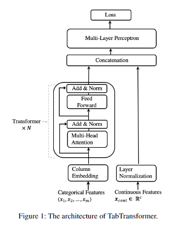

# Paper Notes

## Introduction

- Tabular data is everywhere (recommender systems, portfolio optimization, contests)
- Current methods are Gradient Boosted Decision Trees
  - Easy to train
  - Intepretable
  - Aren't robust to missing data
  - Not suited to continual learning
  - Need special care for textual/image data (encoders, etc.)
  - Not suited for SOTA semi-supervised learning (SSL) methods (like what?)
    - Because they don't produce reliable probability estimation
    - SOTA methods for handling missing/noisy data do not apply
  - Robustness has not been studied
- Classical end-to-end is MLP
  - Context free
  - Not interpretable
  - Don't achieve competitive performance in SSL.
- Paper proposes using transformers
  - Have contextual embeddings
  - Since it is deep learning, it can be made to be:
    - Robust to missing data
    - Suited to continual learning
    - Achieve SOTA performance
  - Parametric Embeddings - Multi-head Attention-Based Transformer Layers -> Contextual Embeddings
  - Highly correlated features have similar embedding vectors
  - TabTransformer is robust to missing/noisy data
  - Current DL models for tabular data are designed for supervised learning, not SSL
  - Current SSL models canot be easily extended to tabular data.
    - Paper uses pre-training methodologies from LMs for pre-training using unlabeled data.
      - This has 2 phases:
        1. Costly pre-training on unlabeled data
        2. Light-weight fine-tuning phase.
      - Most SSL methods require a single phase

## The TabTransformer

1. Split the categorical features into $x_{\text{cat}}$ and all the continuous ones into $x_{\text{cont}}$.
2. Use Column Embedding to embed the categorical features with dimension $d$.
3. Input the parametric embeddings ($\mathbf{E}_{\phi}(x_{\text{cat}})$) to the first Transformer layer.
   1. Input the result into the second transformer layer and so forth. This will create the contextual embeddings.
4. Concatenate the contextual embeddings with the continuous features.
5. Input that vector into an MLP which predicts the target.

We can put them all into a function like so:

$$
\mathcal{L}(\mathbf{x}, y) = H\Big(g_{\psi}\big(f_{\theta}(\mathbf{E}(\mathbf{x}_{\text{cat}})), \mathbf{x}_{\text{cont}}\big), y\Big)
$$

- $H$: Loss function (e.g., Cross-Entropy or MSE)
- $g_{\psi}$: Multi-Layer Perceptron (MLP)
- $f_{\theta}$: Contextual embedding generator
- $\mathbf{E}$: Column embedding lookup
- $\mathbf{x}_{\text{cat}}$: Categorical input features
- $\mathbf{x}_{\text{cont}}$: Continuous input features
- $y$: Target label

### Transformer

- Consists of multi-head self-attention layer, positional-wise feed-forward layer, element-wise addition, and layer normalization.
- Self-Attention
  - Has 3 parametric matrices: $K\in\mathbb{R}^{m\times k}$, $Q\in\mathbb{R}^{m\times k}$, and $V\in\mathbb{R}^{m\times v}$.
    - $m$ is the number of embeddings inputted into the transformer.
    - $k$ is the dimension of the key vector.
    - $v$ is the dimension of the value vector.
  - Every input embedding attends to all other embeddings via an Attention head which is computed as: $\displaystyle{\mathrm{Attention}(Q,K,V)=\mathrm{Softmax}\left(\frac{QK^T}{\sqrt{k}}\right)\cdot V}$.
  - This calculates the *Attention Matrix*, which can be thought of transforming the embedding into a contextual embedding.
  - We then take this output, with dimension $v$, and project it back into the dimension of the embedding $d$ via a fully connected layer.

### Column Embedding

- Each categorical features has its own embedding lookup table, denoted $e_{\phi_i}(.)$
  - The $i$th features with $d_i$ classes' embedding table has $d_i+1$ embeddings where the additional embedding denotes a missing value.
  - The embedding for the encoded value is: $x_i=j\in[0,d_i]$ is $e_{\phi_i}(j)=[c_{\phi_i},w_{\phi_{ij}]}]$ where $c_{\phi_i}\in\mathbb{R}^l$ and $w_{\phi_{ij}}\in\mathbb{R}^{d-l}$
  - The dimension of $c_{\phi_i}$: $l$ is a hyperparameter
  - The unique identifier distinguishes the classes in column $i$ from those in the other columns.
    - The use of the unique identifier is new and designed for tabular data.
  - No reason to use positional encodings since tabular features don't have an ordering.
  - See Appendix A for a comparison of different choices of $l$ and $d$.

### Pre-training the Embeddings

- Contextual embeddings are learned via end-to-end supervised training.
- Paper explores 2 types of pre-training procedures:
  - **Masked Language Modelling**: Randomly selects $k\%$ of the features an masks them as missing. The Transformer layers and column embeddings are then trained via cross-entropy of a multi-class classifier that tries to predict the original features of the masked ones from the contextual embeddings.
  - **Replaced Token Detection**: Instead of masking features, replace them with random values. Here the loss is minimized for a binary classifier to predict whether the features has been replaced or not.

## Experiments

- Evaluated on 15 datasets from the UCI repository, AutoML Challenge, and Kaggle.
  - Links available in Table 9.
  - Both for SSL and Supervised learning
  - Split into 5 cross-validation splits.
  - Train/Validation/Test split is 65/15/20%.
  - Anywhere from 2 to 136 categorical features.
  - In SSL experiments, the authors chose the first $p\in\{50,200,500\}$ observations to be labelled. See Table 8 and 9 in Appendix C for summary statistics for the datasets.
  - The hidden dimension is 32.
  - The number of layers is 6.
  - The number of   attention heads is 8.
  - The MLP (both TabTransformer and comparison) has $\{4l,2l\} layer sizes where $l$ is the size of the input.
  - Hyperparameter Optimization (HPO) was 20 rounds for each cross validation split.
  - Evaluation metric was Area under the Curve (AUC).
  - Pretraining only applied to semi-supervised training.
    - Not much benefit in supervised case.

## The Effectiveness of the Transformer Layers

- MLP comparison is done by removing transformer layers $f_\theta$ from the achitecture and fixing the rest of the components.
- The embeddings $d$ for the categorical features is set as 32 for both models.
- Average 1% improvement.
- Use t-SNE plot to visualize similarity in contextual embeddings from different layers.
  - Seems like post-hoc analysis, how can we know that the reasons for the clusters being seen in the t-SNE visualization are the _real_ reasons?
- Also use embeddings to train logistic regression model.

## The Robustness of TabTransformer

- Used only on categorical features.
- They demosntrate that the TabTransformer is more robust than the MLP by the following:
  1. Replacing values with randomly sampled ones from the features.

## Supervised Learning

## Semi-Supervised Learning
